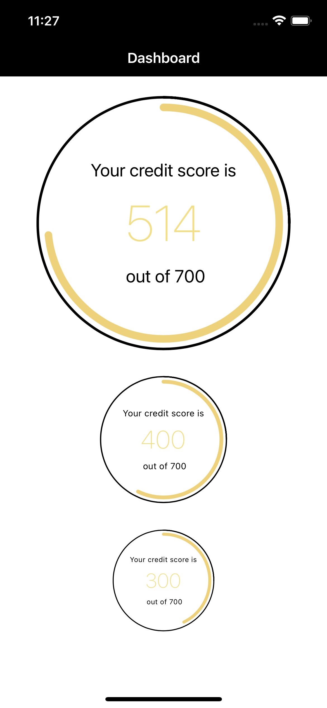

# DonutView
**Version 1.0**

Code and document for creating a Donut view based on your score
 -  Drwaing the DonutView using  CAShapeLayer and UIBezierPath
    
    <p align="center">
      
    </p>
    
    
# Demo

    
## DonutView Example

    The example shows how to create a Donut UI based on a `DonutView` swift class.

    ```swift
    var donutView = DonutView(frame: CGRect, myScore: Int?, totalScore: Int?, countingStartScore: Int?, radius: CGFloat)
    donutView.tag = 1
    
    ```

    ```swift
    //Delegate
    func donutViewScoreTouched(donutViewID: Int)
    ```
    
## Contributor
- Nithin George <nithingeorge3@gmail.com>

- [Requirements](#requirements)
- [Installation](#installation)
    - [Swift Package Manager](#swift-package-manager)
- [Architecture](#Architecture)
- [Target](#Target)
    
## Requirements
* iOS 13.0+
* macOS 10.15+
* Swift 5+

## Installation

### Swift Package Manager

In Xcode:
* File ⭢ Swift Packages ⭢ Add Package Dependency...
* Use the URL https://github.com/Alamofire/Alamofire.git

## Architecture 
* MVVM Architeture. Used Router for Navigation logic
* Followed TDD approch

## Target

* Production
* Staging
* Development
* UnitTest
* UITest


